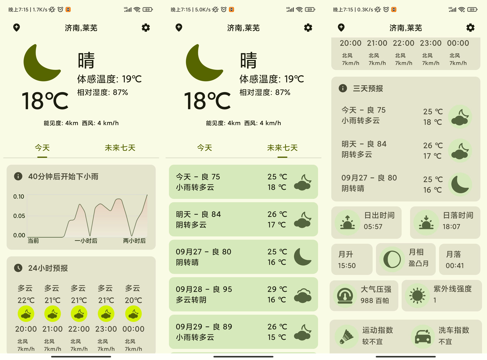
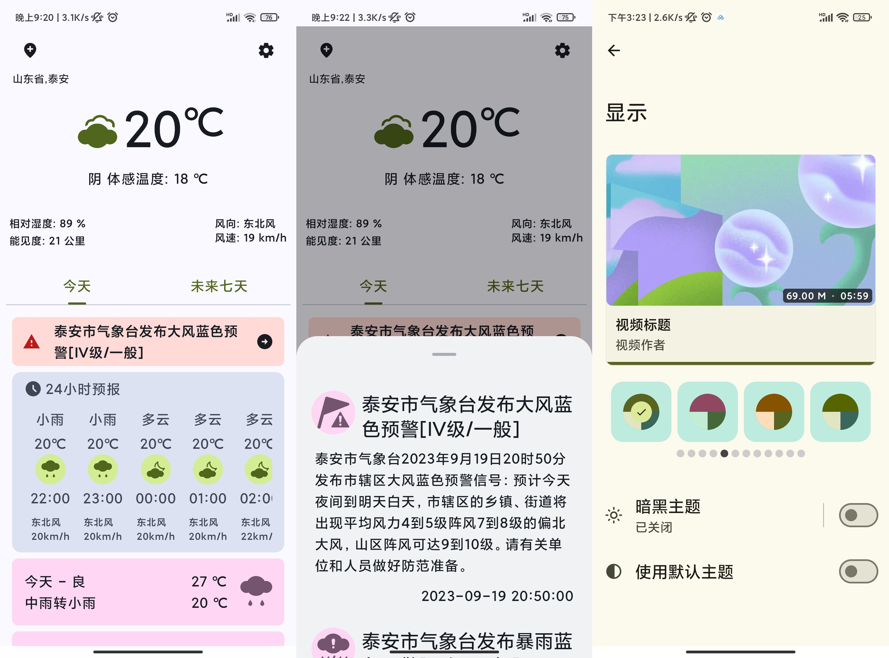
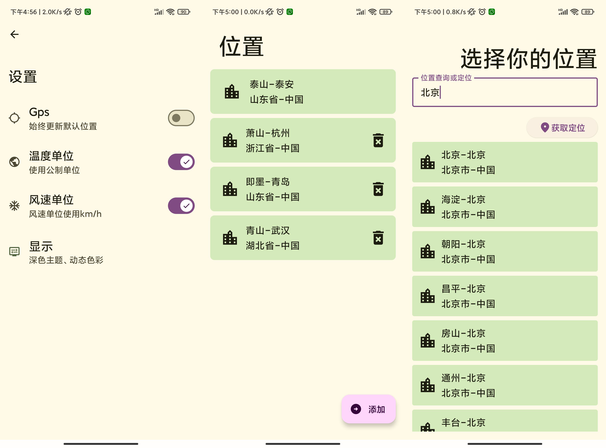
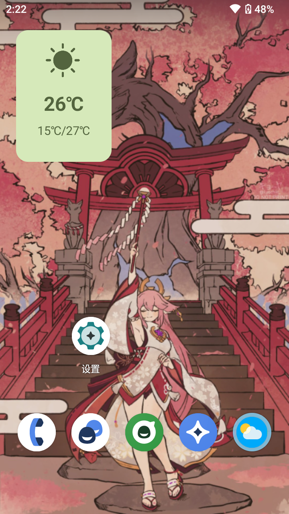
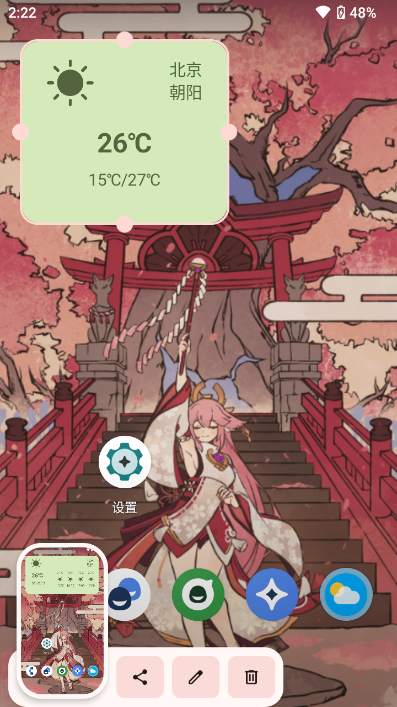
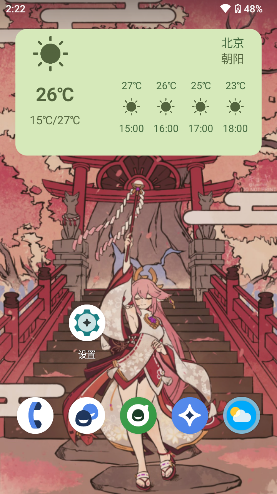
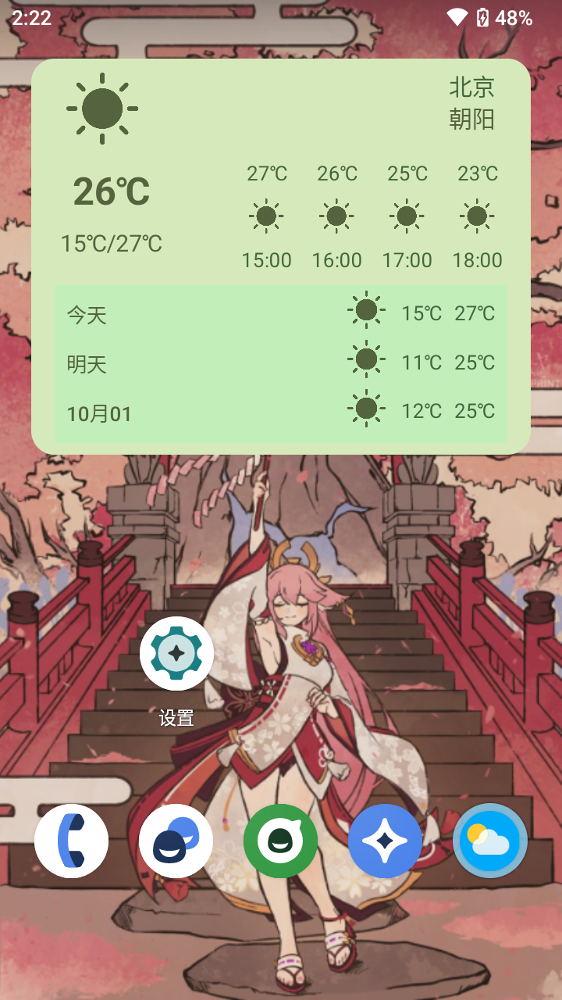

# Compose-Weather

## 概述

这是一个使用kotlin语言，compose制作界面的天气应用，数据源由和风天气提供，天气图标使用的和风天气提供的图标素材，还有部分图标素材来自阿里的素材网站。

目前具有多地区切换，定位，格点天气，24小时预报，当天、三日、七日预报，降水预报，天气预警，空气质量，天气指标等功能。

由于使用了compose,主题切换也变得更加容易，提供了4种主题风格和12种颜色的主题设置，以及相应黑色模式的主题，以及在android12上，可以使用壁纸动态取色。设置页面有参考seal应用，以及使用了seal的一些compose界面函数

## 目前仍在开发中，还不够完善
## 接下来还要开发小部件，通知等功能，以及修复bug

## 截图

   
